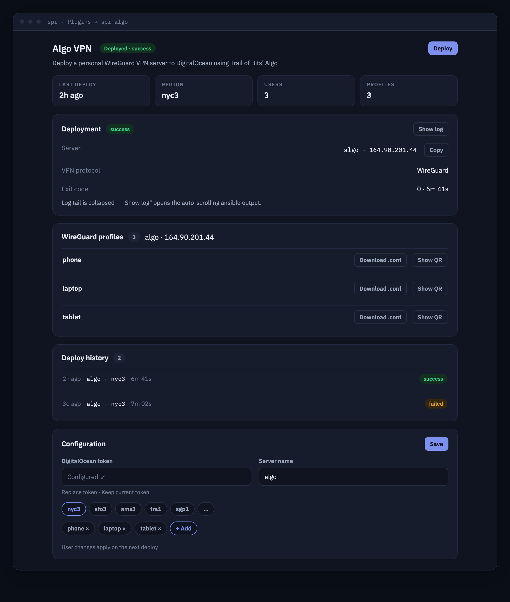

# spr-algo



Deploy a personal [Algo VPN](https://github.com/trailofbits/algo) (WireGuard)
server to your own cloud account, straight from your SPR router.

## About

[Algo](https://github.com/trailofbits/algo) by Trail of Bits is a set of
Ansible playbooks that set up a hardened personal WireGuard/IPsec VPN server
on a cloud provider. This plugin turns SPR into an Algo *deployer*: it vendors
algo at a pinned commit inside the plugin container together with a fully
pinned Python/Ansible environment, gives you a small UI to configure a cloud
provider and a user list, runs the playbook non-interactively as a background
job, and serves the generated per-user WireGuard profiles (`.conf` +
QR `.png`) for download.

The plugin UI is embedded in the SPR interface under Plugins (served as an
iframe from the plugin's unix socket). The backend is a Go daemon listening
only on `/state/plugins/spr-algo/socket` — no host ports.

This plugin was built for the SPR plugin wishlist
([spr-networks/super#341](https://github.com/spr-networks/super/issues/341)).

## Features

- One-click deploy of an Algo WireGuard VPN server to **DigitalOcean**
  (algo's simplest provider path; more providers below)
- User (device) list editor — one WireGuard profile per user
- Live, token-scrubbed ansible log tail while the deploy runs; deploys run as
  a background job and survive UI reloads (state file + history)
- Download generated per-user WireGuard `.conf` files and QR-code `.png`s
- Reproducible container build: algo pinned by full commit hash, all Python
  deps installed from hash-checked pinned wheels, galaxy collections pinned by
  sha256

### MVP scope

- Provider: DigitalOcean only. Other providers algo supports (AWS, Azure, GCE,
  Hetzner, Linode, Vultr, Scaleway, OpenStack, CloudStack, "existing Ubuntu
  server") need provider-specific credentials/extras and are future work.
- WireGuard on, IPsec off, on-demand/adblock/ssh-tunneling flags off.
- `store_pki=true` is forced: the PKI is kept (0600, root-only, inside the
  plugin's config volume) so re-deploys can add/remove users on the same
  server, and because algo's no-PKI path wants a tmpfs mount the unprivileged
  container can't do.
- Changing the user list = edit users, Save, then **Deploy again** (algo
  re-runs against the same droplet; `unique_name` makes it idempotent).

## UI Setup

1. In the SPR UI, go to **Plugins → + New Plugin** and add
   `https://github.com/spr-networks/spr-algo`.
2. Open **spr-algo** at the bottom of the left-hand menu.
3. Create a DigitalOcean personal access token with **read and write** scopes
   at <https://cloud.digitalocean.com/settings/api/tokens> and paste it into
   the API Token field.
4. Pick a region, add one user per device, **Save**, then **Deploy**.
5. After ~5–10 minutes, download the WireGuard profiles from the results card
   and import them into your devices' WireGuard apps (or scan the QR png).

## Command Line Setup

```bash
cd /home/spr/super/plugins/
git clone https://github.com/spr-networks/spr-algo
cd spr-algo
./install.sh   # prompts for SUPERDIR and an SPR API token
```

Then configure the DigitalOcean token, region and users in the plugin UI (or
via the API below).

## API

All endpoints are served on the plugin unix socket and proxied by SPR at
`/plugins/spr-algo/`.

| Method | Path | Description |
| --- | --- | --- |
| GET | `/status` | Plugin overview (deploying?, counts, vendored algo commit) |
| GET | `/config` | Configuration. The DO token is **never returned** — only `DOTokenConfigured: true/false` |
| PUT | `/config` | Update configuration. Empty/`"***"` `DOToken` keeps the stored token |
| POST | `/users` | Replace the user list only (`{"Users": ["phone","laptop"]}`). Takes effect on next deploy |
| POST | `/deploy` | Start a deploy job. `409` if one is already running |
| GET | `/deploy/status` | Latest job state + sanitized tail of the ansible log |
| GET | `/deploys` | Deploy history |
| GET | `/configs` | List generated WireGuard profiles (`[{Server, User, File, HasQR}]`) |
| GET | `/configs/{server}/{user}.conf` | Download a WireGuard profile (text/plain) |
| GET | `/configs/{server}/{user}.conf.png` | QR code for the profile, as JSON `{"PNGBase64": …}` |
| GET | `/topology` | Plugin contribution to SPR's topology view (`{"Nodes":[…],"Edges":[…]}`) |

### Topology

The plugin declares `"HasTopology": true`, so SPR merges its graph into the
router topology view. `GET /topology` always includes the root anchor node
(`{"ID":"root","ConnType":"wireguard","Online":true}`); after at least one
successful deploy it adds one `vpn-server` node per deployed Algo server
(named `<server> (<region>)`, `IP` = instance address, `Online` = whether the
most recent finished deploy succeeded) and one `profile` node per generated
WireGuard profile (profiles are credentials, not live devices, so they are
always offline). Edges run `profile → server → root` on layer `vpn`. With no
successful deploy the graph is the root node only.

### Configuration reference (`configs/plugins/spr-algo/config.json`, 0600)

| Field | Default | Notes |
| --- | --- | --- |
| `Provider` | `digitalocean` | Only supported value in MVP |
| `DOToken` | — | DigitalOcean API token. Write-only via API; stored 0600 |
| `Region` | — | DO region slug (`nyc3`, `ams3`, …). Static list in the UI |
| `ServerName` | `algo` | Droplet name (`[A-Za-z0-9-]{1,32}`) |
| `Users` | `[]` | Device/user names (`[A-Za-z0-9_-]{1,32}`, unique) |
| `WireGuardEnabled` | `true` | Forced `true` in MVP |
| `IPsecEnabled` | `false` | Forced `false` in MVP |
| `OndemandCellular`/`OndemandWifi`/`DNSAdblocking`/`SSHTunneling` | `false` | Forced `false` in MVP |

### How the deploy runs

The backend answers every prompt of algo's `input.yml` via a JSON extra-vars
file (written 0600 under `/state/plugins/spr-algo`, deleted after the run) and
executes, as a child process of the plugin daemon:

```
ansible-playbook main.yml -e @deploy-<id>-vars.json    (cwd /algo)
```

The DigitalOcean token is passed via the `DO_API_TOKEN` environment variable
(algo reads it there) so it never appears on argv, in the vars file, or in the
ansible log (`algo_no_log` is on by default upstream). Log tails returned by
the API are additionally scrubbed of anything token-shaped.

Algo's output tree (`/algo/configs`) is symlinked to
`/configs/spr-algo/algo/` so the SSH deploy key, PKI and generated profiles
persist across container updates.

## Security model

- **No published ports, no capabilities.** The container gets only outbound
  WAN + DNS (`NetworkCapabilities.Policies: ["wan","dns"]`) plus the
  `vpn-algo` SPR group. It uses egress to reach the DigitalOcean API and the
  new droplet over SSH. It creates no tunnels or
  firewall rules on the router itself, so there is no `NET_ADMIN`, no
  `/dev/net/tun`, and `no-new-privileges` is set. The VPN it deploys runs in
  your cloud account, not on the router.
- **Secrets**: the DO token and everything algo generates (SSH deploy key,
  CA/PKI, WireGuard private keys) live under `configs/plugins/spr-algo/`
  (mode 0600/0700, root-only, mounted only into this container). The token is
  never included in GET responses; log output returned by the API is scrubbed
  of the configured token and any token-shaped strings.
- **Input validation**: user names, region, server name and token format are
  allow-list validated server-side; nothing user-controlled is interpolated
  into a shell (the playbook is exec'd with a fixed argv).
- The SPR API is **not** called by this plugin at runtime (no `ScopedPaths`).

## Reproducible builds

Everything the image contains is pinned:

- Base images (ubuntu, node, alpine, SPR container template, buildkit,
  dockerfile syntax) by digest — see `reproducible.env`.
- apt packages from `snapshot.ubuntu.com` at `UBUNTU_SNAPSHOT` in both build
  and runtime stages.
- Go toolchain by version + sha256.
- **algo** by full commit hash (`ALGO_COMMIT`), verified with
  `git rev-parse` after fetch.
- Python deps from `requirements-algo.txt`: versions taken from algo's own
  `uv.lock` at `ALGO_COMMIT`, installed with
  `pip install --require-hashes --no-deps --only-binary=:all:`. Every hash was
  produced by downloading the wheel and sha256'ing it, cross-checked against
  PyPI. Regenerate with `./scripts/update-python-pins.py`.
- Ansible Galaxy collections that algo pins tighter than the ansible bundle
  (`community.crypto`, `community.general`) as sha256-verified artifacts; the
  rest of the DigitalOcean path (`community.digitalocean`, `ansible.posix`,
  `ansible.utils`) ships inside the pinned `ansible` wheel.

Build bit-for-bit with `./build_docker_compose.sh` (uses `reproducible.env`,
`SOURCE_DATE_EPOCH=0`, buildkit `rewrite-timestamp`). Refresh pins with
`./update-pins.sh` (and `./scripts/update-python-pins.py` when `ALGO_COMMIT`
moves).

Note: algo's playbooks call `uv pip …` for its preflight self-checks; the
image ships a tiny `/usr/local/bin/uv` shim (`scripts/uv-shim.sh`) that
forwards `uv pip list` to the baked venv and no-ops `uv pip install`, since
all dependencies are preinstalled from pinned wheels.

## Upstream

- <https://github.com/trailofbits/algo> — AGPL-3.0. The plugin image vendors
  algo at `ALGO_COMMIT` (see `reproducible.env`); this repository's own code
  is MIT.
